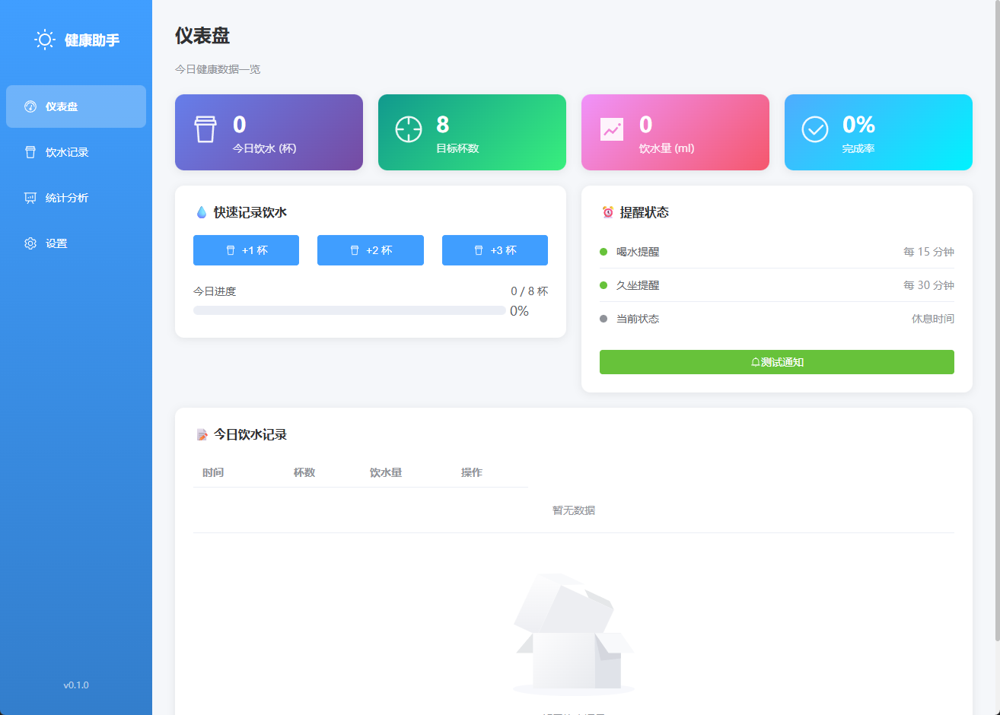
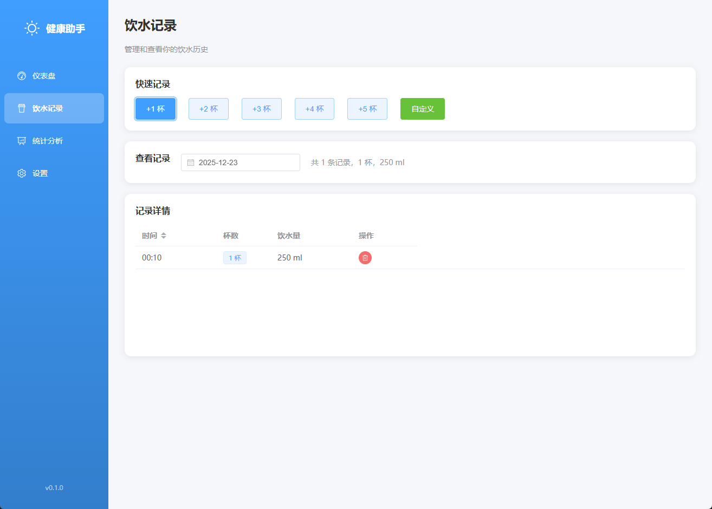
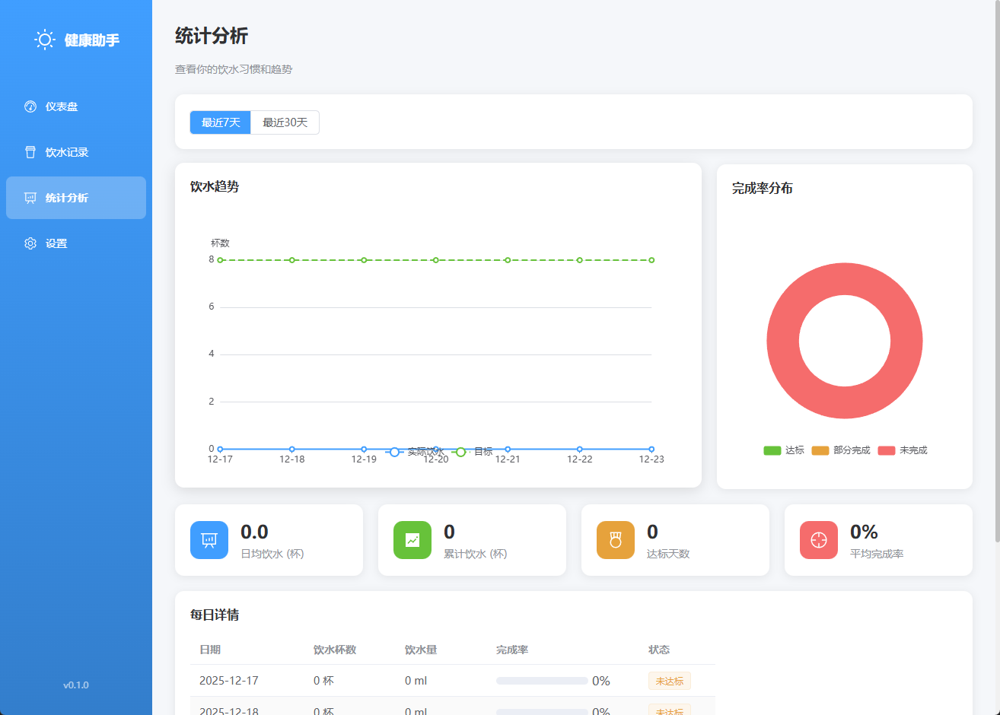
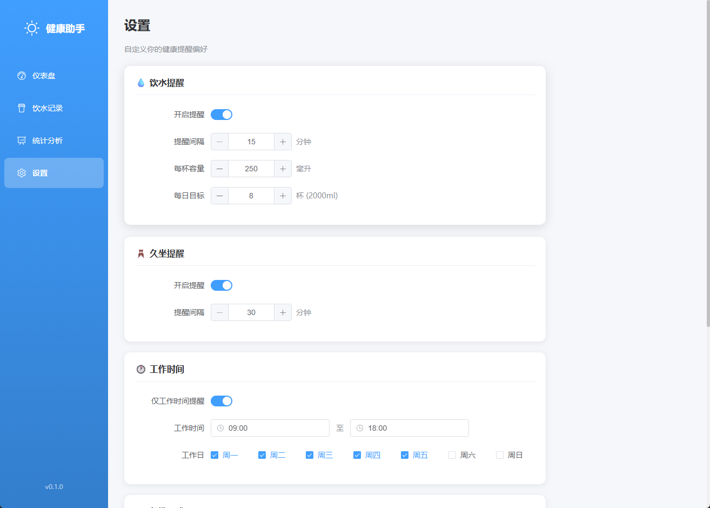

# 健康提醒助手

<p align="center">
  
</p>

<p align="center">
  <strong>一款基于 Tauri + Vue 3 的桌面健康提醒应用</strong>
</p>

<p align="center">
  帮助你养成规律喝水和定时活动的好习惯
</p>

<p align="center">
  
  
  
  
  
</p>

---

## 功能特性

### 核心功能
- 💧 **喝水提醒** - 定时提醒补充水分，可自定义间隔时间（15-120分钟）
- 🪑 **久坐提醒** - 久坐后提醒起身活动，保护身体健康（30-180分钟）
- 📝 **饮水记录** - 记录每日饮水量，支持快速添加和历史查看
- 📊 **统计分析** - 可视化图表展示饮水趋势和完成率

### 贴心设计
- 🎯 **目标设置** - 设置每日饮水目标，追踪完成进度
- 🕐 **工作时间** - 仅在工作时间段内发送提醒
- 🔇 **勿扰模式** - 休息时间自动静默，支持跨午夜设置
- ⏸️ **暂停/恢复** - 随时暂停提醒，恢复后继续倒计时
- 🔔 **提醒声音** - 可开关的提示音，确保不错过提醒

### 系统集成
- 📌 **开机自启动** - 随系统启动自动运行
- 📥 **托盘最小化** - 关闭窗口时最小化到系统托盘
- ⏱️ **托盘倒计时** - 鼠标悬停托盘图标显示下次提醒时间
- 🖥️ **系统通知** - 使用原生系统通知，不干扰工作

## 应用截图


<p align="center">
  
  
  
  
</p>

## 环境要求

### 必需软件

| 软件 | 版本要求 | 下载地址 |
|------|----------|----------|
| Node.js | >= 18.0 | https://nodejs.org/ |
| Rust | >= 1.77 | https://rustup.rs/ |
| pnpm | >= 8.0 | `npm install -g pnpm` |

### Windows 额外要求

- **Microsoft Visual Studio C++ Build Tools**
  - 下载: https://visualstudio.microsoft.com/visual-cpp-build-tools/
  - 安装时选择 "使用 C++ 的桌面开发" 工作负载

- **WebView2 Runtime** (Windows 10/11 通常已预装)
  - 下载: https://developer.microsoft.com/microsoft-edge/webview2/

## 快速开始

### 1. 克隆项目

```bash
git clone https://github.com/your-username/health-attention.git
cd health-attention
```

### 2. 安装依赖

```bash
pnpm install
```

### 3. 开发模式运行

```bash
pnpm tauri dev
```

> ⚠️ **首次运行说明**：
> - 首次运行会下载并编译 Rust 依赖，可能需要 5-10 分钟
> - 请确保网络畅通（部分依赖需要从 crates.io 下载）
> - 编译完成后，应用窗口会自动打开

### 4. 打包成安装程序

```bash
pnpm tauri build
```

打包完成后，安装程序位于：
```
src-tauri/target/release/bundle/
└── nsis/
    └── 健康提醒助手_0.1.0_x64-setup.exe
```

## 使用说明

### 主界面

启动应用后，你会看到四个主要页面：

| 页面 | 功能 |
|------|------|
| 🏠 仪表盘 | 今日饮水概览和快速操作 |
| 📋 饮水记录 | 管理历史饮水记录 |
| 📈 统计分析 | 查看趋势图表和数据分析 |
| ⚙️ 设置 | 自定义各项提醒参数 |

### 快速记录饮水

在仪表盘页面，点击 **+1杯**、**+2杯**、**+3杯** 按钮快速记录饮水。

### 系统托盘

| 操作 | 效果 |
|------|------|
| 左键单击 | 显示主窗口 |
| 右键单击 | 显示菜单 |
| 鼠标悬停 | 显示倒计时 |

托盘菜单选项：
- 📺 显示窗口
- 🙈 隐藏窗口
- ⏸️ 暂停/恢复
- ❌ 退出程序

### 设置项说明

| 设置项 | 默认值 | 范围 |
|--------|--------|------|
| 喝水提醒间隔 | 45分钟 | 15-120分钟 |
| 久坐提醒间隔 | 60分钟 | 30-180分钟 |
| 每杯容量 | 250ml | 100-500ml |
| 每日目标 | 8杯 | 1-20杯 |
| 工作时间 | 09:00-18:00 | - |
| 工作日 | 周一至周五 | - |
| 提醒声音 | 开启 | 开/关 |
| 关闭时最小化 | 开启 | 开/关 |

## 项目结构

```
health-attention/
├── src/                        # Vue 前端源码
│   ├── components/             # 公共组件
│   │   └── Sidebar.vue         # 侧边栏导航
│   ├── views/                  # 页面视图
│   │   ├── Dashboard.vue       # 仪表盘
│   │   ├── Records.vue         # 饮水记录
│   │   ├── Statistics.vue      # 统计分析
│   │   └── Settings.vue        # 设置页面
│   ├── stores/                 # Pinia 状态管理
│   │   ├── reminder.ts         # 提醒逻辑
│   │   ├── settings.ts         # 设置管理
│   │   └── water.ts            # 饮水记录
│   ├── types/                  # TypeScript 类型
│   ├── router/                 # 路由配置
│   └── App.vue                 # 根组件
├── src-tauri/                  # Tauri 后端 (Rust)
│   ├── src/
│   │   └── lib.rs              # Rust 核心逻辑
│   ├── icons/                  # 应用图标
│   ├── Cargo.toml              # Rust 依赖
│   └── tauri.conf.json         # Tauri 配置
├── package.json
├── vite.config.ts
└── tsconfig.json
```

## 技术栈

| 类别 | 技术 |
|------|------|
| 前端框架 | Vue 3 + TypeScript |
| 桌面框架 | Tauri 2.0 (Rust) |
| UI 组件 | Element Plus |
| 状态管理 | Pinia |
| 图表库 | ECharts |
| 构建工具 | Vite |
| 数据存储 | tauri-plugin-store |
| 系统通知 | tauri-plugin-notification |

## 开发命令

```bash
# 安装依赖
pnpm install

# 开发模式（热重载）
pnpm tauri dev

# 仅运行前端
pnpm dev

# 仅构建前端
pnpm build

# 打包桌面应用
pnpm tauri build
```

## 常见问题

<details>
<summary><b>Q: 首次运行 pnpm tauri dev 很慢？</b></summary>

首次运行需要下载和编译 Rust 依赖，这是正常现象。后续运行会使用缓存，速度会快很多。
</details>

<details>
<summary><b>Q: 提示 "rustc" 命令找不到？</b></summary>

请确保 Rust 已正确安装并添加到 PATH：
```bash
rustc --version
# 如果未安装，访问 https://rustup.rs/ 下载安装
```
</details>

<details>
<summary><b>Q: Windows 通知不显示？</b></summary>

请检查 Windows 设置：
1. 设置 → 系统 → 通知
2. 确保"通知"已开启
3. 确保应用的通知权限已开启
</details>

<details>
<summary><b>Q: 如何完全退出程序？</b></summary>

点击关闭按钮默认会最小化到托盘。完全退出请：
1. 右键点击托盘图标
2. 选择"退出程序"

或在设置中关闭"关闭时最小化到托盘"选项。
</details>

<details>
<summary><b>Q: 如何暂停提醒？</b></summary>

1. 右键点击托盘图标
2. 选择"暂停/恢复"
3. 再次点击可恢复提醒
</details>

## 更新日志

### v0.1.0 (2024-12)
- 🎉 首个发布版本
- ✅ 喝水提醒功能
- ✅ 久坐提醒功能
- ✅ 饮水记录管理
- ✅ 统计图表分析
- ✅ 系统托盘支持
- ✅ 开机自启动
- ✅ 工作时间/勿扰模式
- ✅ 暂停/恢复功能
- ✅ 托盘倒计时显示
- ✅ 提醒声音开关

## 贡献指南

欢迎提交 Issue 和 Pull Request！

1. Fork 本仓库
2. 创建特性分支 (`git checkout -b feature/AmazingFeature`)
3. 提交更改 (`git commit -m 'Add some AmazingFeature'`)
4. 推送到分支 (`git push origin feature/AmazingFeature`)
5. 提交 Pull Request

## 许可证

本项目基于 [MIT License](LICENSE) 开源。

---

<p align="center">
  Made with ❤️ for your health
</p>
